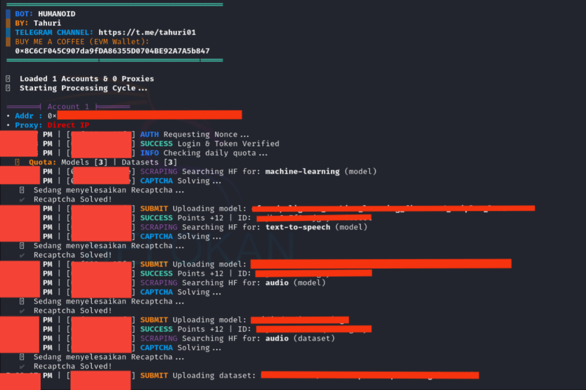

# BOT HUMANOID



**Fitur:**

**• Multi Account**

**• Auto Upload Models & Datasets**

**• Supports Proxy w/o Proxy**

## Requirements

Before running this project, make sure you have installed:

- Node.js
- npm (Node Package Manager)
- 2captcha key (edit solver.js)

## Installation

1. **Clone this repository:**

    ```plaintext
    git clone https://github.com/TahuriGroup/Human
    cd Human

2. **Install the required packages:**

    ```plaintext
    npm install fs axios ethers readline https-proxy-agent socks-proxy-agent @2captcha/captcha-solver

3. **Add your accounts in the privatekey.txt file. Example:**

    ```plaintext
   0xxxx

4. **If you want to use a proxy, edit the proxy.txt file. Example:**
   ```plaintext
   http://username:password@ip:port

5. **Edit solver.js if you want custom solver by other solver captcha**

6. **Run the script:**
   ```plaintext
   node main.js
   
## Support

If you have any questions or need further assistance, feel free to join our Telegram channel at [t.me/tahuri01](https://t.me/tahuri01).

## License

This project is licensed under the [MIT License](LICENSE).
